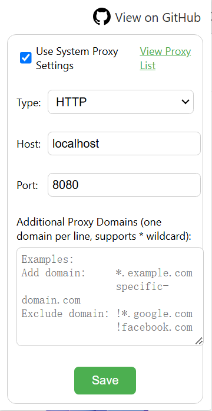
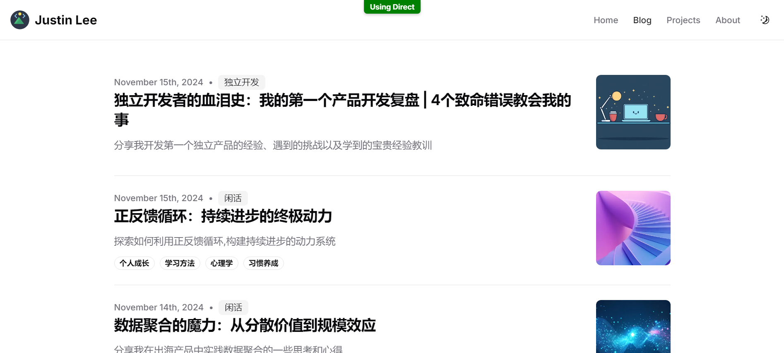
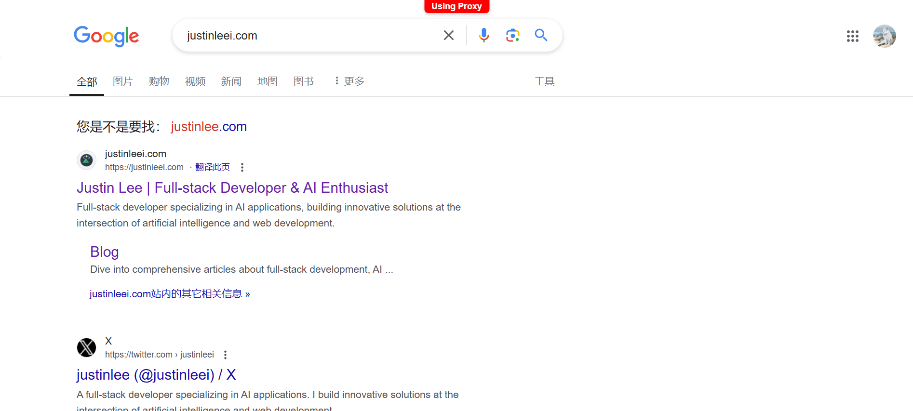

# FirewallBypass Browser Proxy Extension
[Chinese](./README.zh.md) | English
## Table of Contents
1. [Introduction](#introduction)
2. [Features](#features)
3. [Installation](#installation)
4. [Usage](#usage)
5. [Project Structure](#project-structure)
6. [FAQ](#faq)

## Introduction

This is a **lightweight proxy extension** for Chrome browser that automatically switches proxy settings based on predefined domain lists. The extension supports independent proxy configuration without affecting the system's global proxy settings.

## Features

- Supports HTTP/HTTPS/SOCKS5 proxy protocols
- Smart proxy routing based on domains
- Built-in extensive preset proxy rules
- Custom proxy domain addition/exclusion
- Regular expression domain matching
- Real-time proxy status display
- Proxy rule search and view functionality
- Clean user interface

## Installation

1. Clone or download this project
2. Run `npm install` to install dependencies
3. Open Chrome browser and navigate to `chrome://extensions/`
4. Enable "Developer mode"
5. Click "Load unpacked" and select the project directory

## Usage

1. Click the extension icon in the browser toolbar
2. Configure proxy server information in the popup window:
   - Proxy type (HTTP/HTTPS/SOCKS5)
   - Server address
   - Port number
3. View and search the built-in proxy rules list
4. Add custom proxy domain rules in the text box:
   - Add proxy domain: `domain.com` or `*.domain.com`
   - Exclude domain: `!domain.com` or `!*.domain.com`
5. Click "Save" to apply settings
6. When proxy is enabled, the extension will display current proxy status at the top of the page

### Interface Preview

*Main configuration interface*

*Proxy status indicator at the top of the page*

## Project Structure

- `manifest.json`: Extension configuration file
- `popup.html/js`: Popup window interface
- `background.js`: Background proxy control logic
- `content.js`: Page proxy status display
- `proxy-list.txt`: Preset proxy rules list
- `package.json`: Project dependencies configuration

## FAQ

**Q: Why isn't the proxy working after configuration?**
A: Please check:
1. If proxy server address and port are correct
2. If the extension is enabled
3. If the accessed domain is in the proxy rules list

**Q: How to add custom proxy rules?**
A: Add domains in the extension settings text box, supporting these formats:
- `domain.com`: Exact domain match
- `*.domain.com`: Subdomain match
- `!domain.com`: Domain exclusion
- `regexp:pattern`: Regular expression match

## License

MIT License